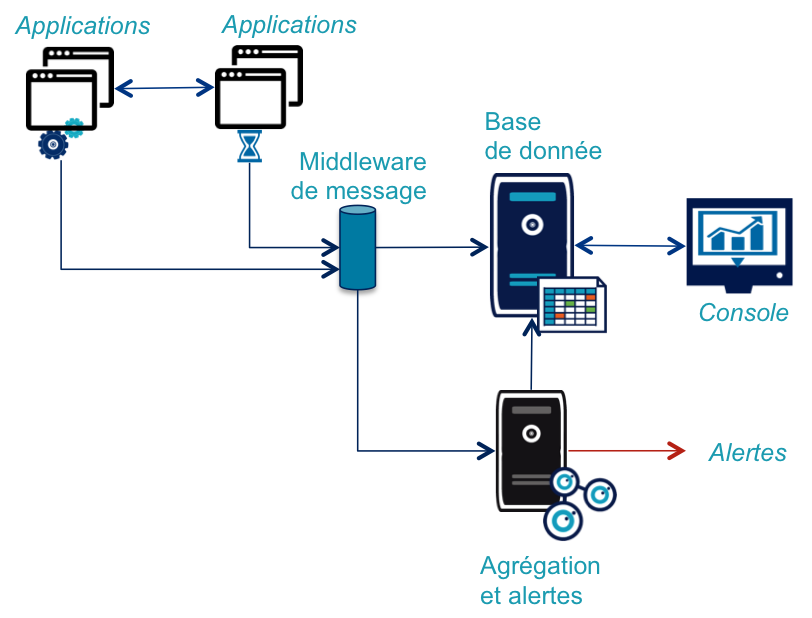
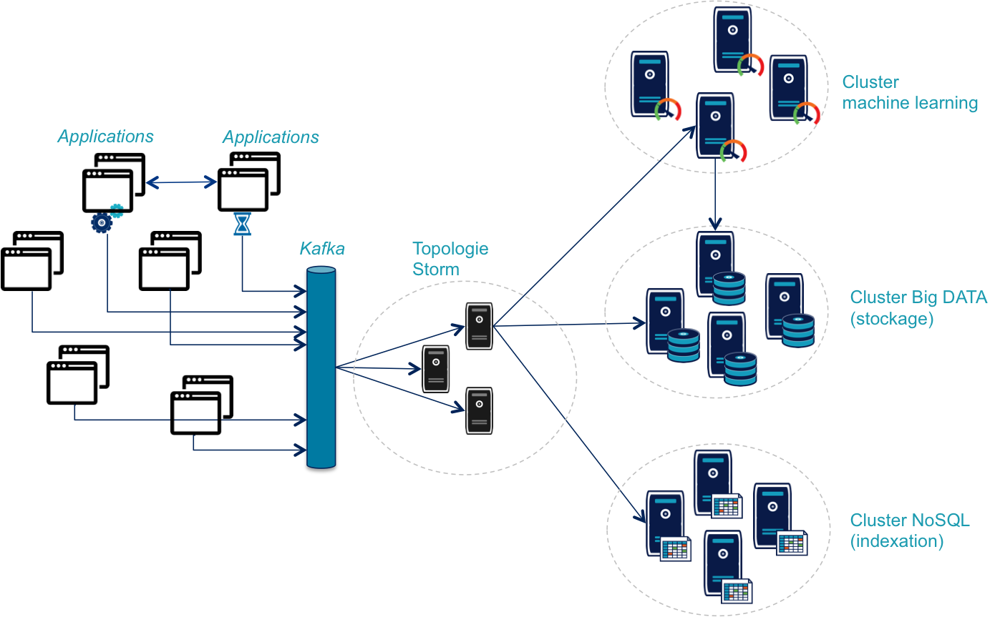

# Présent et avenir du monitoring de flux

Avoir un monitoring de flux performant est critique : intégrant tous les flux de données il est à même d'offrir une vision synthétique de tout le système d'information.

L'objectif de cet article est de vous permettre de comparer votre système actuel avec les bonnes pratiques généralement observées et de vous donner des pistes d'évolution.

# Monitoring de flux ?

On appelle un *flux* un **ensemble d'appels de services et/ou d'envois de messages qui ensemble forment un service métier**. Dans un système d'information complexe, un tel flux traverse souvent plusieurs applications et utilise parfois plusieurs technologies : par exemple un utilisateur clique sur un écran qui déclenche un appel REST qui provoque une invocation SOAP dont le traitement envoie une série de messages JMS.

Monitorer ces flux signifie donc mettre en place un monitoring des activités métier *(Business Activity Monitoring)*. Cela consiste à collecter des données dans toutes les couches applicatives pour les corréler. Cela permet d'obtenir **une vision transverse agrégée** de l'activité de votre système d'information. Ce monitoring doit fournir à tout moment **l'état de santé et la performance des fonctions métiers importantes** *(Key Performance Indicator)*. Dans le passé ces informations étaient souvent calculées séparément pour chaque couche technique.

Le monitoring de flux **ne remplace pas le monitoring de composants mais le complète** de la même manière que les tests d'intégration complètent les tests unitaires. Chaque brique doit être surveillée isolément d'une manière technique pour identifier les problèmes qui lui sont propres, alors que le monitoring de flux va s'intéresser aux éléments transverses et métier qui nécessitent une vision globale du système. Il y a un bien une zone de recouvrement entre les deux mais il ne faut pas les confondre ou utiliser l'un pour remplacer l'autre.

Dans la suite de l'article un message métier signifiera indifféremment le contenu d'un appel de service ou d'un message envoyé.

## Pour avoir un bon monitoring de flux

### Fonctionnalités

La fonctionnalité essentielle est d'être capable d'**identifier les flux métier** dans les messages atomiques. Généralement cela passe par l'utilisation d'un identifiant unique (*correlation id*). Tous les messages d'un même flux devront donc contenir le même identifiant. Cela passe par la mise en place d'une brique spécifique dans les différents applicatifs chargée de générer l'identifiant en début de chaîne et de le propager dans les traitements. Cette brique sera aussi responsable de transmettre une copie des messages pour qu'elle soit intégrée dans le monitoring.

Le système doit être capable de prendre en compte **des évènements hétérogènes** : si les messages envoyés par les différents composants comportent des éléments communs (horodatage par exemple) ils comportent aussi des informations spécifiques liées au métier du service (nom du service métier, identifiant d'objets). Être capable d'intégrer facilement ces différentes données permettra de construire au plus juste des métriques fonctionnelles qui évolueront en même temps que les services.

Pour pouvoir exploiter au mieux ces données, il faut disposer d'un système de **dashboarding configurable** : il ne s'agit pas seulement de prédéfinir un ensemble d'écrans de monitoring fixes, mais aussi de pouvoir s'en servir pour des études ou des investigations. Les systèmes de monitoring utilisés habituellement sont souvent mal adaptés à ce type d'usage: leur ergonomie "à l'ancienne" rend l'exploration de données pénible. Par ailleurs il s'agit beaucoup de solutions monolithiques intégrant monitoring collecte et stockage de données.

La base de données doit fournir des fonctionnalités d'**indexation** avec une couverture maximum, l'idéal étant d'indexer l'intégralité des champs des données. Cela permet de simplifier les investigations en cas d'erreur : on pourra par exemple identifier tous les messages qui concernent un certain numéro de compte. Pour des questions de volume, on pourra limiter l'indexation dans le temps (48 heures au moins), en gardant la possibilité de réindexer des messages passés.

### Contraintes

#### Ne jamais interférer avec le métier

Un échec dans la brique de monitoring ne doit **jamais entrainer de conséquences sur le fonctionnel**, il faut donc bien isoler techniquement les deux.

Ensuite le monitoring ne doit **pas entrainer de baisse de performances**, les messages de monitoring doivent être envoyés sous forme d'évènements asynchrones (pattern *[wiretap](http://www.enterpriseintegrationpatterns.com/WireTap.html)*) à l'aide d'un middleware de messages. Il est souhaitable d'avoir une infrastructure de message dédiée, car on évite ainsi tout risque de surcharge.

#### Limiter les développements spécifiques

Enfin il faut **limiter les développements métier dans les briques de monitoring** : si de la configuration ou un peu de développement spécifique est inévitable, surtout pour les métriques les plus précises, il faut éviter de recoder des comportements fonctionnels. Le résultat est souvent fragile et va rendre plus difficile les évolutions du métier.

### Briques logicielles nécessaires

Pour répondre à ces critères, on peut donc identifier les différentes briques qui sont nécessaires pour le monitoring de flux :
- Les informations sont transmises sous forme d'événements dans un middleware de message dédié.
- Un système de traitement de messages pour faire des agrégations et de la détection d'évènements.
- Une base de données indexée où ils sont stockés.
- Une console de monitoring pour les exploiter.

# Pratiques actuelles

Votre système d'information comporte déjà une partie des blocs techniques dont on a besoin, comme un système de messages ou une base de données. Malheureusement, les spécificités du monitoring empêchent souvent d'utiliser les mêmes outils :

- Du fait du grand nombre de messages entrant dans le système, les middlewares classiques n'offrent pas une capacité de traitement suffisante, il est donc nécessaire d'utiliser un **système de communication spécialisé** pour ce type de volume : [AMQP](http://www.amqp.org), [SNMP](http://en.wikipedia.org/wiki/Simple_Network_Management_Protocol), [RSYSLOG](http://www.rsyslog.com), [ZeroMQ](http://zeromq.org).

- Pour le traitement de messages, un système de **[CEP](http://en.wikipedia.org/wiki/Complex_event_processing)** (*complex event processing*) comme [Drool Fusion](http://docs.jboss.org/drools/release/latest/drools-docs/html/DroolsComplexEventProcessingChapter.html) va gérer les aspects techniques. Il va conserver en mémoire un état du système sur lequel on définit des règles déclenchant des traitements ou des alertes.

- La base de données doit **stocker des messages ayant des formats hétérogènes et qui évoluent** avec les applications. On s'orientera donc généralement vers une solution de stockage de type NoSQL permettant d'avoir des schémas de données dynamiques tout en fournissant partitionnement et scalabalité afin d'absorber le volume et le débit de données entrant. Les fonctionnalités d'indexation d'**[Elastic Search](http://www.elasticsearch.org)** en font généralement un bon choix.

- Pour le dashboarding [Kibana](http://www.elasticsearch.org/overview/kibana/) est le produit de référence pour visualiser des données stockées dans Elastic Search : il permet de construire des écrans riches de manière flexible.

# Le futur

Ce type d'architecture reposant sur des briques standard est limité sur deux aspects, le premier est technique et le second fonctionnel.

## Toujours plus de messages

La première limite est liée à l'augmentation du nombre de messages à traiter. Dans des systèmes basés sur les nouvelles architectures de micro-services et qui intègrent de nouveaux usages (applications mobiles, Internet des objets) le nombre de messages est démultiplié. L'objectif du système de monitoring étant de continuer à absorber l'intégralité des messages il doit voir ses capacités augmenter dans les mêmes proportions.

Cela entraine la mise en place de plusieurs solutions :
- Même en choisissant un broker rapide, les solutions de middleware de messages classiques plafonnent à quelques milliers de messages par seconde. Il faut alors se tourner vers des solutions **«Fast Data»** dont [Kafka](http://kafka.apache.org) semble aujourd'hui devenir la solution de référence.
- L'intégration de messages dans le système de stockage doit passer par une solution d' **« Event Streaming »**. Les solutions envisageables sont par exemple [Apache Storm](https://storm.apache.org) ou [Apache Spark Streaming](https://spark.apache.org/streaming/).
- Le stockage d'un tel volume de données sera réalisé sur **un système de stockage distribué** comme une [Apache Cassandra](http://cassandra.apache.org) ou [HDFS](http://hadoop.apache.org/docs/r1.2.1/hdfs_design.html#Introduction) d'Hadoop. Le stockage dans Elastic Search pourra être conservé pour des besoins de requêtage rapide sur des données récentes.

Ce type d'architecture "big data" permettant un traitement en flux porte le nom de [DataLake](http://www.forbes.com/sites/ciocentral/2011/07/21/big-data-requires-a-big-new-architecture/)

## Des analyses plus poussées

Après les moteurs de règles classiques, on commence à se tourner vers des solutions d'analyse plus pointues permettant de mieux mesurer ce qui se passe mais aussi de mieux prévoir. Dans cette optique, la composante métier du monitoring prend de plus en plus de poids et la distinction avec la BI s'efface et nous sommes convaincus qu'on verra bientôt des solutions d'*online machine learning* enrichir ces systèmes.

# Conclusion

Nous espérons vous avoir convaincu de la valeur qu'apporte le monitoring de flux. Aujourd'hui il est essentiel pour des raisons d'exploitation, demain il vous apportera également de la valeur métier. La mise en place ce type de solution dans un système d'information est un chantier structurant mais qui s'appuie sur des composants ouverts et bien connus, il n'y donc aucune raison pour ne pas s'y mettre.
